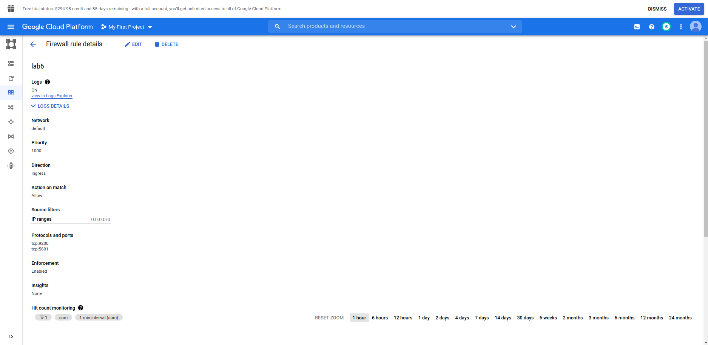
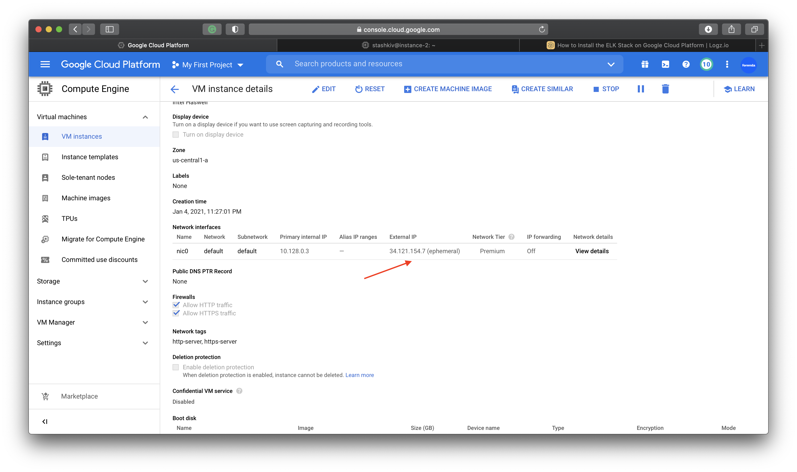
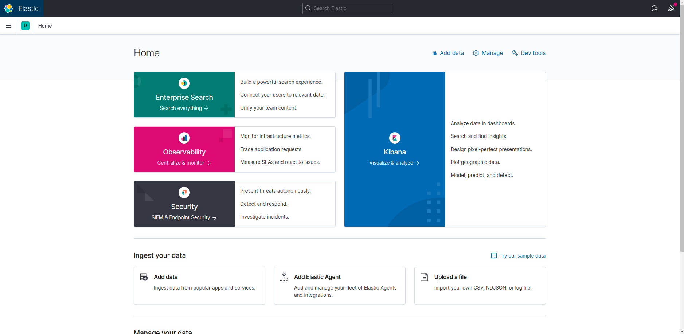
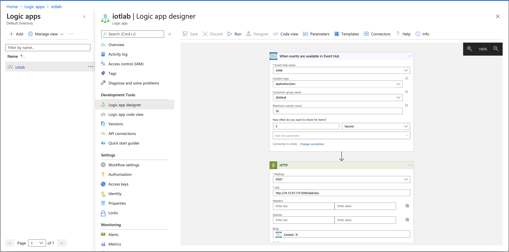
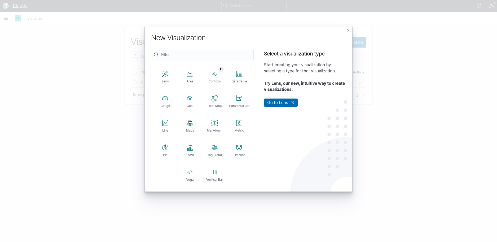

### Підготовка GCP

1. Створюємо instance в VM instances. При створенні вибираємо Boot Disk – Ubuntu. В параметрах Firewall – на обидвох пунктах галочки.

2. Переходимо в деталі створеного instance, вибираємо Firewall. Стоворюємо новий rule.
Параметри:
* Name: elasticsearch
* Logs: on
* Source IP ranges: 0.0.0.0/0
* Tcp: 9200

3. Створюємо ще один rule.
Параметри:
* Name: kibana
* Logs: on
* Source IP ranges: 0.0.0.0/0
* Tcp: 5601



4. Переходимо на створений instance і натискаємо SSH

5. Виконуємо почерзі дані команди:
```
sudo apt-get install default-jre
sudo apt update
sudo apt install apt-transport-https
wget -qO - https://artifacts.elastic.co/GPG-KEY-elasticsearch | sudo apt-key add -
sudo sh -c 'echo "deb https://artifacts.elastic.co/packages/7.x/apt stable main" > /etc/apt/sources.list.d/elastic-7.x.list'
sudo apt update
sudo apt install elasticsearch
sudo service elasticsearch status
sudo systemctl enable elasticsearch.service
sudo systemctl start elasticsearch.service
curl -X GET "localhost:9200/"
sudo nano /etc/elasticsearch/elasticsearch.yml
# change inside kibana
#  network.host: 0.0.0.0
#  discovery.seed_hosts: []

sudo service elasticsearch restart

sudo apt-get install apt-transport-https
echo "deb https://artifacts.elastic.co/packages/5.x/apt stable main" | sudo tee -a /etc/apt/sources.list.d/elastic-5.x.list
sudo apt-get update
sudo apt-get install logstash
sudo service logstash start
echo "deb http://packages.elastic.co/kibana/7.0/debian stable main" | sudo tee -a /etc/apt/sources.list.d/kibana-7.0.x.list
sudo wget --directory-prefix=/opt/ https://artifacts.elastic.co/downloads/kibana/kibana-7.6.1-amd64.deb
sudo dpkg -i /opt/kibana*.deb
sudo apt-get update
sudo apt-get install kibana
sudo nano /etc/kibana/kibana.yml
# change inside kibana.yml
#  server.port: 5601
#  server.host: "0.0.0.0"

sudo service kibana start
sudo service kibana status
```

6. Для перевірки роботи копіюємо з інформації про instance External IP



7. Переходимо на порт 5601 нашого External IP



# Підготовка Azure

1. Шукаємо Logic Apps та створюємо новий прив'язаний до вже створеної в попередній лабораторній Resource Group.

2. Переходимо в Logic App Designer
* Створюємо початковий тригер When events are available in Event Hub
* Створюємо послідовний step для надсилання HTTP запиту



3. Зберігаємо та натискаємо Run.

4. Додаємо нові дані в Event Hub через Postman (Аналогічно попередній лабораторній)

5. Дані відобразяться у веб-інтерфейсі Kibana. Щоб розпочати перегляд та візуалізацію даних – додаємо index (lab6*)


