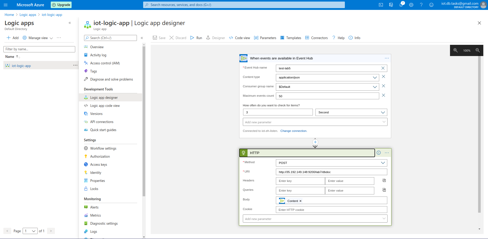

# lab 6
### GCP configuration

1. Create new Ubuntu VM instance in GCP.

2. Create new firewall rule and apply it to all instances. The parameters should be the following:
Параметри:
* Name: lab6
* Logs: on
* Source IP ranges: 0.0.0.0/0
* Tcp: 9200, 5601

 

3. SSH to the instance and execute the following:
```
sudo apt update
sudo apt-get install default-jre
sudo apt install apt-transport-https
wget -qO - https://artifacts.elastic.co/GPG-KEY-elasticsearch | sudo apt-key add -
sudo sh -c 'echo "deb https://artifacts.elastic.co/packages/7.x/apt stable main" > /etc/apt/sources.list.d/elastic-7.x.list'
sudo apt update
sudo apt install elasticsearch
sudoedit /etc/elasticsearch/elasticsearch.yml
# change inside kibana
#  network.host: 0.0.0.0
#  discovery.seed_hosts: []

sudo systemctl start elasticsearch
sudo systemctl enable elasticsearch

sudo apt-get install logstash
sudo systemctl start logstash
echo "deb http://packages.elastic.co/kibana/7.0/debian stable main" | sudo tee -a /etc/apt/sources.list.d/kibana-7.0.x.list
sudo wget --directory-prefix=/opt/ https://artifacts.elastic.co/downloads/kibana/kibana-7.6.1-amd64.deb
sudo dpkg -i /opt/kibana*.deb
sudo apt-get update
sudo apt-get install kibana
sudoedit /etc/kibana/kibana.yml
# change inside kibana.yml
#  server.port: 5601
#  server.host: "0.0.0.0"

sudo systemctl start kibana
```

4. To check if it works copy instance's External IP and go to it with port 5601.


### Azure configuration

1. Create new Logic App connected to previously created Resource Group.

2. Go to Logic App Designer:
* Create first trigger When events are available in Event Hub
* Create further step for sending HTTP-request



3. Save and then run

4. Add new data to Event Hub the same way as in 5th lab.

5. Data should be written to elasticsearch and we can view them in Visualization tab.


