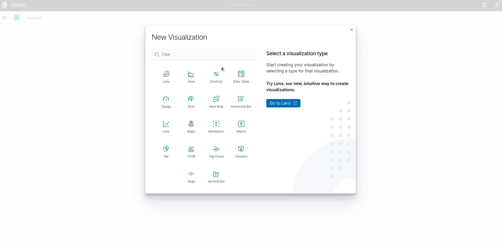
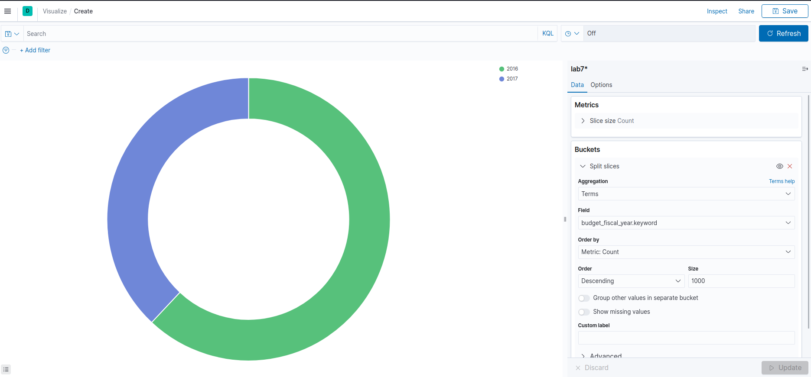
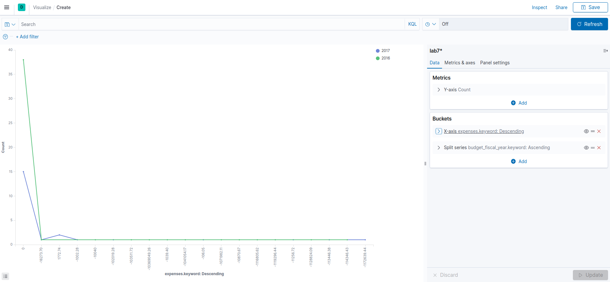
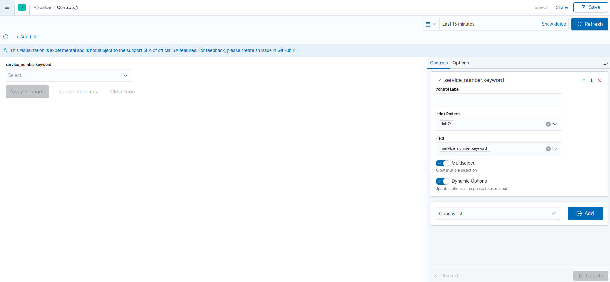
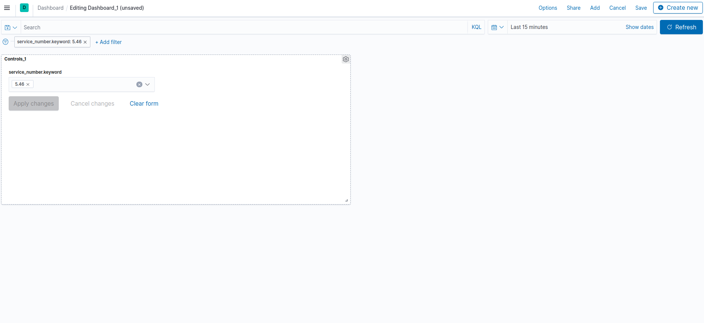
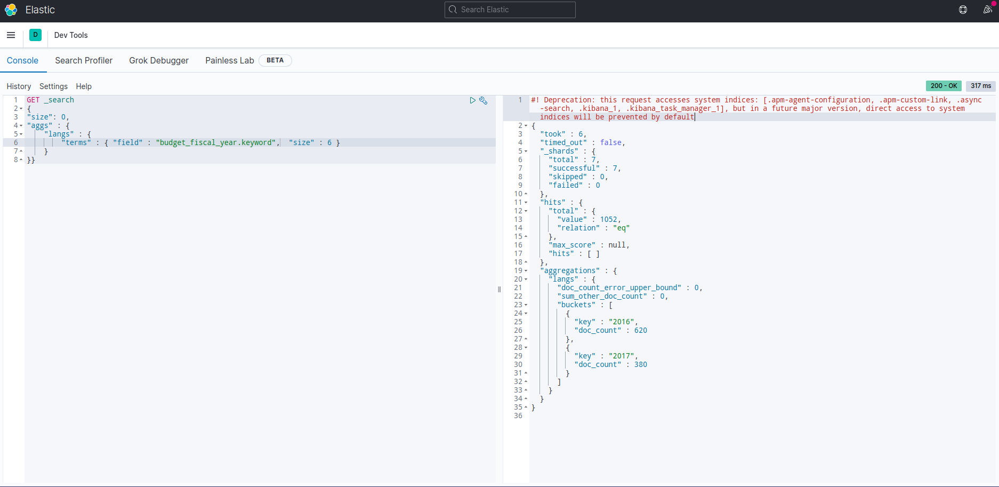
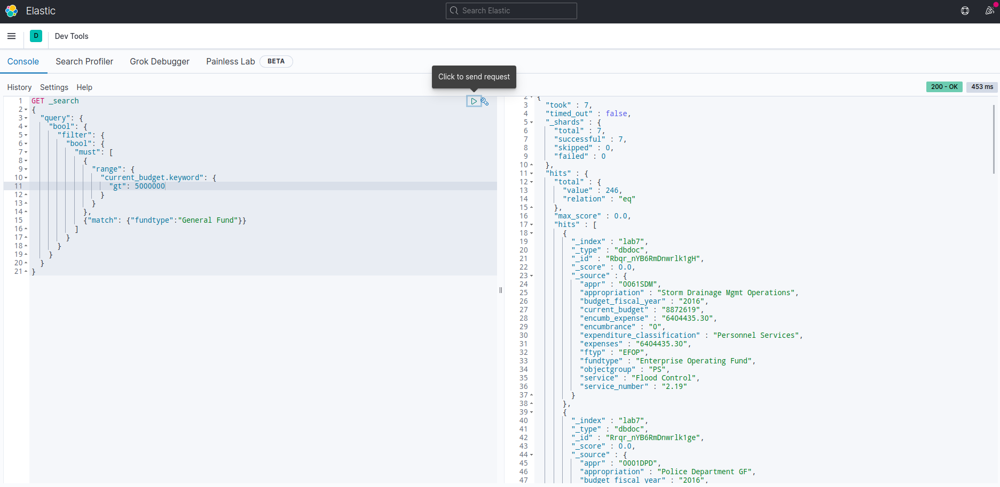

# Підготовка візуалізацій

1. Створюємо візуалізацію типу Pie



2. При створенні візуалізації треба вибрати налаштування Bucket. Зберігаємо візуалізацію.



3. Аналогічно створюємо візуалізацію типу Line, але з налаштуваннями Split



4. Створюємо візуалізацію типу Controls



5. Додаємо створені візуалізації на Dashboard та зберігаємо його.



6. За допомогою Controls можна фільтрувати дані по необхідних характеристиках.

# Kibana devTools запити

1. Топ-3 за полем map.current_budget.keyword
```
GET _search
{
"size": 0,
"aggs" : {
    "langs" : {
        "terms" : { "field" : "map.current_budget.keyword",  "size" : 3 }
    }
}}
```



2. Фільтрація записів за датою
```
GET _search
{
  "query": {
    "bool": {
      "filter": {
        "bool": {
          "must": [
            {
              "range": {
                "map.budget_fiscal_year.keyword": {
                  "gt": "2016-03-21T15:37:08.595919Z",
                  "lte": "2017-04-21T15:52:08.595919Z"
                }
              }
            }
          ]
        }
      }
    }
  }
}
```

