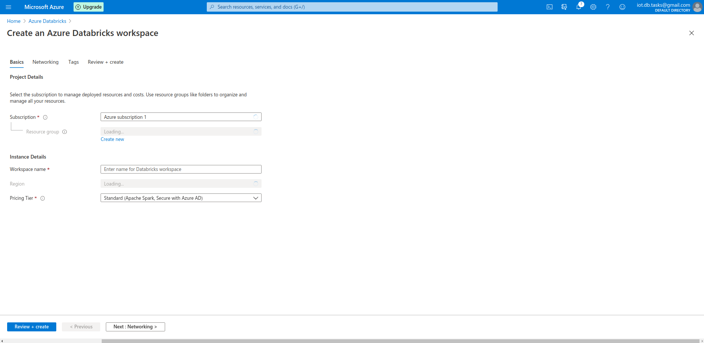
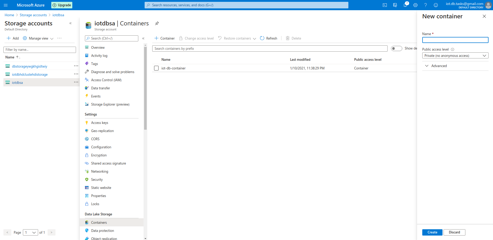
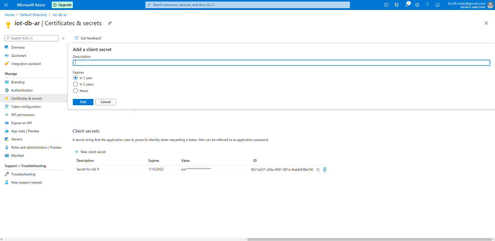
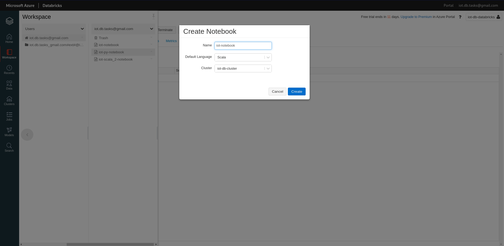
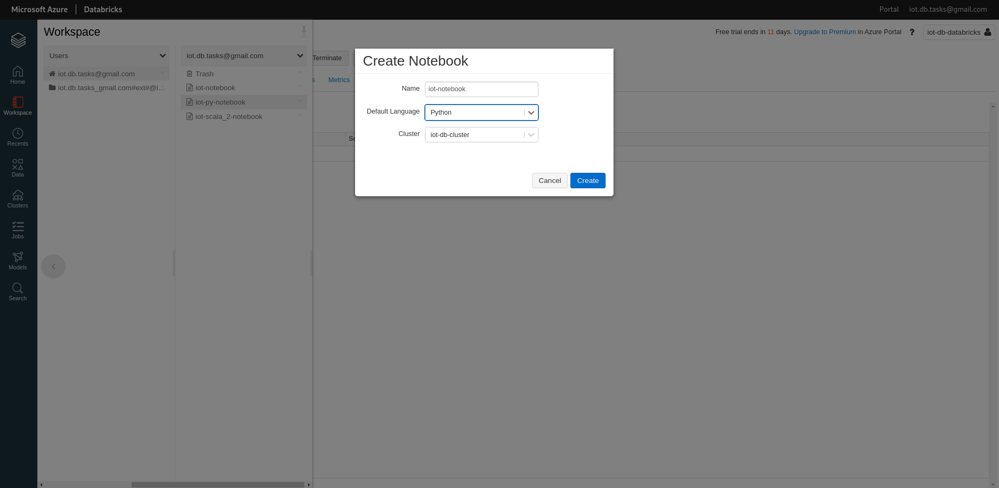

1. Create new Resource group in Azure and add new Azure Databricks instance



2. Add Storage account. Hierarchical namespace – Enabled. Replecation – LRS


3. Create new container in Data Lake Storage



4. Inside container we need to create new Directory

5. Run Azure Databricks Service


6. Create new cluster


7. Go to Azure Active Directory and create new App Registration.


8. Create new client secret.



9. Then go to Access Control -> Role assignments –> Add role assignment. Role – Contributor. Select – our previously created application.


10. Go to Libraries tab in new cluster –> Install New –> Maven. Coordinates: ` com.microsoft.azure:azure-eventhubs-spark_2.12:2.3.18-9 `


11. In Home page choose Create Notebook. Then we need to create new Scala Notebook.



12. Create another Python notebook. 



13. We need to configure access to directory in Data Lake container. Download Azure Storage Explorer (https://azure.microsoft.com/features/storage-explorer/) -> Choose our created container –> <Created folder> –> Manage ACLs –> Choose our app and grant it full rights.


14. Copy/paste code to Python Notebook. Copy fields' values Azure Active Directory -> App registration -> Previously created registration.
* Copy Application (client) ID to ` fs.azure.account.oauth2.client.id ` 
* Copy secret id ` fs.azure.account.oauth2.client.secret ` 
* Paste Directory (tenant) ID from overview tab into "fs.azure.account.oauth2.client.endpoint" just after https://login.microsoftonline.com/ .
* iotlab8 should be changed to Storage name after @.
* iotlab8 should be changed to Container name after @.

```
# Databricks notebook source
# DBTITLE 1,Mount Data Lake
configs = {"fs.azure.account.auth.type": "OAuth",
         "fs.azure.account.oauth.provider.type": "org.apache.hadoop.fs.azurebfs.oauth2.ClientCredsTokenProvider",
         "fs.azure.account.oauth2.client.id": "e3679eeb-c988-4175-af88-c68fb56089f0",
         "fs.azure.account.oauth2.client.secret": "zuca-8Cvsih66hmLg7.0xiIxP-NIuI.Z1m",
         "fs.azure.account.oauth2.client.endpoint": "https://login.microsoftonline.com/8d0bf70e-8dbb-4da4-9163-2852235ccd8a/oauth2/token",
         "fs.azure.createRemoteFileSystemDuringInitialization": "true"}

dbutils.fs.mount(
        source = "abfss://iot-db-container@iotdbsa.dfs.core.windows.net",
        mount_point = "/mnt/labs",
        extra_configs = configs)

display(dbutils.fs.ls('mnt/labs'))
```        


16. Paste code to Scala notebook previously chnaging the values.
```
import org.apache.spark.eventhubs.{ ConnectionStringBuilder, EventHubsConf, EventPosition }
import org.apache.spark.sql.types._
import org.apache.spark.sql.functions._

// To connect to an Event Hub, EntityPath is required as part of the connection string.
val connectionString = ConnectionStringBuilder("Endpoint=sb://iot-db-lab.servicebus.windows.net/;SharedAccessKeyName=listen-policy;SharedAccessKey=Bm2aXigdSGXzcBoeB1YYsoT8M9oY0vVDBiwC8yiR6zY=;EntityPath=test-eventhub")
  .setEventHubName("test-eventhub")
  .build
val eventHubsConf = EventHubsConf(connectionString)
  .setStartingPosition(EventPosition.fromEndOfStream)

var streamingInputDF = 
  spark.readStream
    .format("eventhubs")
    .options(eventHubsConf.toMap)
    .load()

val filtered = streamingInputDF.select (
  from_unixtime(col("enqueuedTime").cast(LongType)).alias("enqueuedTime")
     , get_json_object(col("body").cast(StringType), "$.incidentum").alias("year")
     , get_json_object(col("body").cast(StringType), "$.servyr").alias("leading_cause")
     , get_json_object(col("body").cast(StringType), "$.servnumid").alias("sex")
     , get_json_object(col("body").cast(StringType), "$.watch").alias("race")
)

filtered.writeStream
  .format("com.databricks.spark.json")
  .outputMode("append")
  .option("checkpointLocation", "/mnt/labs/lab9dir/")
  .start("/mnt/labs/lab9dir/")
```  

  
  
17. Generate new data with ```make``` command.

18. In the folder data should be generated.


