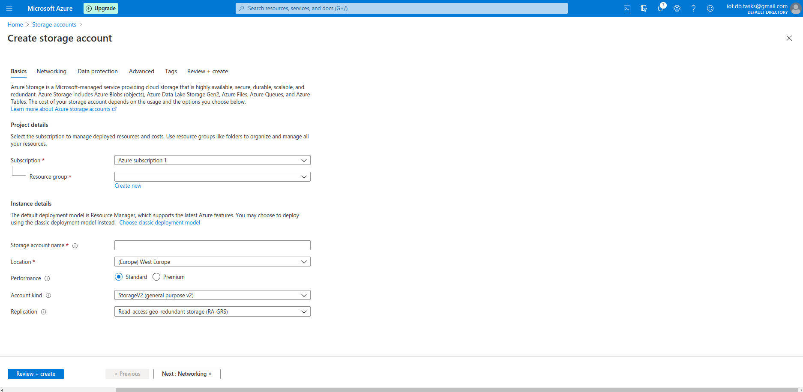
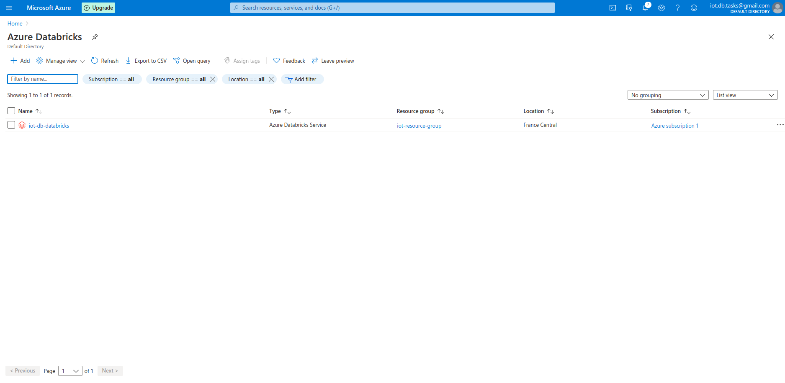
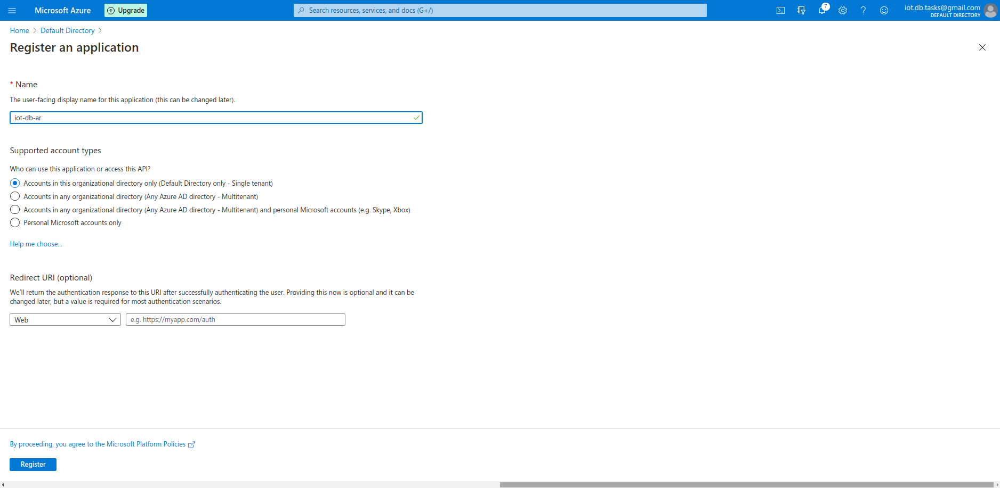
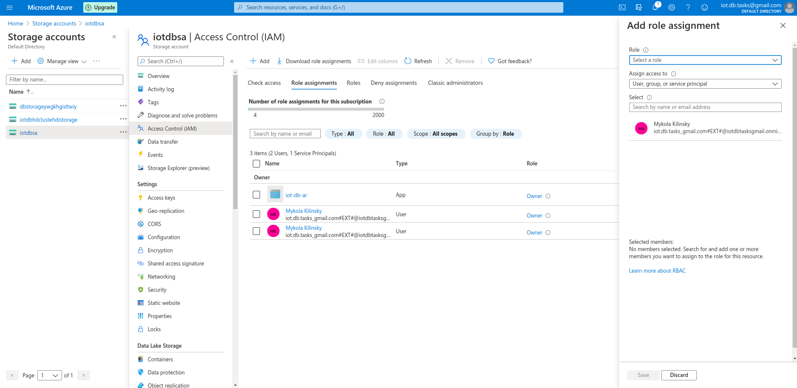
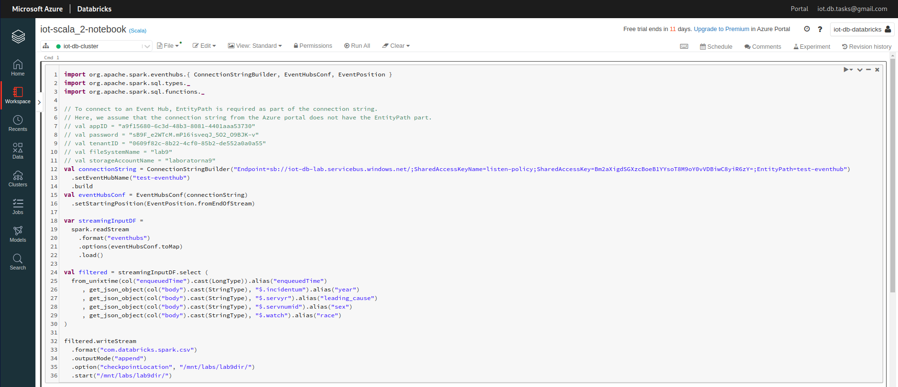

1. Створюємо нову Resource group в Azure і додаємо Azure Databricks


2. Додаємо Storage account. Hierarchical namespace – Enabled. Replecation – LRS



3. Створюємо новий контейнер в Data Lake Storage


4. Всередині створеного контейнеру додаємо Directory

5. Запускаємо Azure Databricks Service



6. Створюємо новий кластер


8. Знаходимо Azure Active Directory, переходимо в App registrations та створюємо новий.



9. Переходимо Certificates & secrets та створюємо новий client secret


10. Заходимо в Access Control -> Role assignments –> Add role assignment. Роль – Contributor. Select – наша раніше створена аплікація.



11. В новостороненому кластері заходимо Libraries –> Install New –> Maven. Coordinates: ` com.microsoft.azure:azure-eventhubs-spark_2.12:2.3.18-9 `


12. На сторінці Home вибираємо Create Notebook. Створюємо Notebook на Python.


13. Сворюємо аналогічно ще один на Scala. 


14. В Data Lake потрібно налаштувати доступ до директорії. Завантажуємо Azure Storage Explorer (https://azure.microsoft.com/features/storage-explorer/) -> Вибираємо створений контейнер –> Створена папка –> Manage ACLs –> Вибираємо свою програму і даємо їй максимальні права доступу. Аналогічно даємо максимальні права доступу через контейнер.


15. В Python Notebook вставляємо код. Відповідні поля копіюємо з Azure Active Directory -> App registration -> Створений попередньо registartion.
* Копіюємо Application (client) ID та встаялємо в ` fs.azure.account.oauth2.client.id ` 
* В Certificates & secrets копіюємо ID раніше створеного Client secret та вставляємо в ` fs.azure.account.oauth2.client.secret ` 
* В "fs.azure.account.oauth2.client.endpoint" після https://login.microsoftonline.com/ вставляємо Directory (tenant) ID з вкладки Overview.
* iotlab8 після @ заміняємо на відповідне ім'я Storage account
* iotlab8 перед @ заміняємо на відповідне ім'я Container

```
# Databricks notebook source
configs = {"fs.azure.account.auth.type": "OAuth",
         "fs.azure.account.oauth.provider.type": "org.apache.hadoop.fs.azurebfs.oauth2.ClientCredsTokenProvider",
         "fs.azure.account.oauth2.client.id": "22d8-98-92dd-0ba9-4962-841e-48ff4328d776",
         "fs.azure.account.oauth2.client.secret": "Q6tb8-w7.9E-I6IX43ORl8-9GciI_X.B4ZvY",
         "fs.azure.account.oauth2.client.endpoint": "https://login.microsoftonline.com/ef310ea2-8-92f6-4cce-b23d-902e68-90b496f/oauth2/token",
         "fs.azure.createRemoteFileSystemDuringInitialization": "true"}

dbutils.fs.mount(
        source = "abfss://iotlab8@iotlab8.dfs.core.windows.net",
        mount_point = "/mnt/labs",
        extra_configs = configs)
```        


16. В Scale Notebook вставляємо код і агалогічно з попереднім пунктом заміняємо поля на актуальні і запускаємо код.
```
import org.apache.spark.eventhubs.{ ConnectionStringBuilder, EventHubsConf, EventPosition }
import org.apache.spark.sql.types._
import org.apache.spark.sql.functions._

// To connect to an Event Hub, EntityPath is required as part of the connection string.
// Here, we assume that the connection string from the Azure portal does not have the EntityPath part.
val appID = "22d8-98-92dd-0ba9-4962-841e-48ff4328d776"
val password = "Q6tb8-w7.9E-I6IX43ORl8-9GciI_X.B4ZvY"
val tenantID = "ef310ea2-8-92f6-4cce-b23d-902e68-90b496f"
val fileSystemName = "iotlab8";
var storageAccountName = "iotlab8";
val connectionString = ConnectionStringBuilder("Endpoint=sb://iotlab.servicebus.windows.net/;SharedAccessKeyName=RootManageSharedAccessKey;SharedAccessKey=vTWd+WE3a8-9aess0U62ZVBOyS0XGJBlObvp6C2afXxas=")
  .setEventHubName("iotlab")
  .build
val eventHubsConf = EventHubsConf(connectionString)
  .setStartingPosition(EventPosition.fromEndOfStream)

var dataset = 
  spark.readStream
    .format("eventhubs")
    .options(eventHubsConf.toMap)
    .load()
      
val filtered = dataset.select(
    from_unixtime(col("enqueuedTime").cast(LongType)).alias("enqueuedTime")
      , get_json_object(col("body").cast(StringType), "$.year").alias("year")
      , get_json_object(col("body").cast(StringType), "$.leading_case").alias("leading_case")
      , get_json_object(col("body").cast(StringType), "$.sex").alias("sex")
        , get_json_object(col("body").cast(StringType), "$.race").alias("race")
        , get_json_object(col("body").cast(StringType), "$.deaths").alias("deaths").cast(DoubleType)
        , get_json_object(col("body").cast(StringType), "$.death_rate").alias("death_rate").cast(DoubleType)
        , get_json_object(col("body").cast(StringType), "$.death_rate_adjusted").alias("death_rate_adjusted").cast(DoubleType)
  )
  
filtered.writeStream
  .format("com.databricks.spark.csv")
  .outputMode("append")
  .option("checkpointLocation", "/mnt/labs/iotlab8")
  .start("/mnt/labs/iotlab8")
```  

  
  
17. Генеруємо дані запустивши команду ```make```

18. В відповідній папці мають успішно згенеруватись дані


